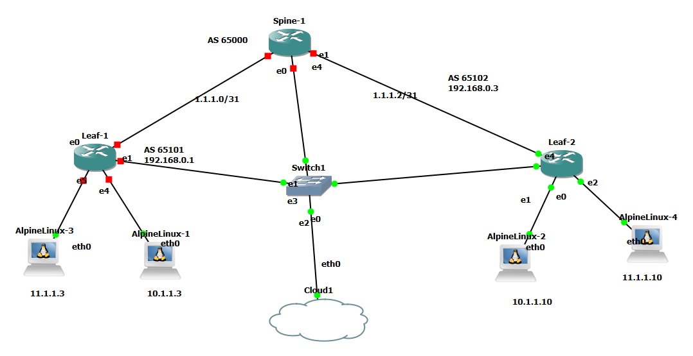

# Networking-automation-using-cluade-ai-MCP-server-and-Sonic
Networking automation using MCP server and Sonic. The topology is made of spine and leaf routers running sonic with vxlan evpn configuration. After bringing up the topology. Run broadband sonic on all the routers and configure the spine leaf with vxlan. Connect mcp server using claude ai, run show commands and push configurations to configure and manage the topology.

## 🚀 Overview

This project leverages Gns3 lab with three Broadcom sonic routers  Claude AI and the Model Context Protocol (MCP) to provide intelligent network automation capabilities. It combines the power of AI-driven decision making with industry-standard Ansible playbooks to manage Broadcom network devices efficiently.

### Key Features

- **AI-Powered Automation**: Use Claude AI to intelligently manage network configurations
- **MCP Server Integration**: Seamless integration with Claude through MCP for dynamic network operations
- **Ansible Integration**: Industry-standard playbooks for reliable network automation
- **Broadcom Gns3 Router Support**: Direct support for Broadcom Router devices
- ***BGP underlay configuration** : BGP is used as underlay configuration
- **Vxlan Evpn Configuration**: Automated OSPF routing protocol management
- **Alpine Linux as server endpoints**: Alpine servers in different vlans

  
## 📋 Prerequisites

- [x] Gns3 with Broadcom sonic image
- [x] Python 3.8 or higher
- [x] Access to Claude API with MCP Server capability
- [x] Broadcom sonic router images that will be deployed in Gns3
- [x] SSH access configured for your network devices
- [x] Alpine Linux images that will be deployed as endpoints on Gns3

## ⚒️ Project Tech Stack
The main tools and technologies used for building the project:
- [x] Claude AI (Claude Code)
- [x] MCP Server (FastMCP)
- [x] GNS3
- [x] Python
- [x] Netmiko (Sonic devices don't support Scrapli yet)
- [x] Broadcom 
- [x] Alpine Linux
- [x] VS Code

# The topology consists of one Broadcom Spine connected to two Broadcom Leafs with two Alpine Linux connected to the each Leaf



[x] Spine/ Leaf vxlan evpn configuration with BGP underlay. Vlan 10 and 11 are L2 VNI with vlan 200 is L3 VNI
---
%%%%%%%%%%%%
leaf2
%%%%%%%%%%%%%

interface Vlan10
 description "Green-Servers VLAN"
 ip vrf forwarding Vrf1
 ip anycast-address 10.1.1.254/24
!
interface Vlan11
 description "Red-Servers VLAN"
 ip vrf forwarding Vrf1
 ip anycast-address 11.1.1.254/24
!
interface Vlan2000
 description "IRB VLAN"
 ip vrf forwarding Vrf1
 ipv6 enable
!
interface Loopback 0
 ip address 192.168.1.3/32
!
interface Loopback 1
 description "source ip for VXLAN interface"
 ip address 100.2.2.2/32

interface Loopback 0
 ip address 192.168.1.3/32
!
interface Loopback 1
 description "source ip for VXLAN interface"
 ip address 100.2.2.2/32


interface Ethernet0
 description "Link to EndPoint-2"
 mtu 9100
 speed 25000
 fec none
 no shutdown
 switchport access Vlan 10
!
interface Ethernet1
 mtu 9100
 speed 25000
 fec none
 no shutdown
 ip address 192.168.108.10/24
!
interface Ethernet2
 mtu 9100
 speed 25000
 fec none
 no shutdown
 switchport access Vlan 11
 

router bgp 65102 vrf Vrf1
 router-id 192.168.0.3
 log-neighbor-changes
 timers 60 180
 !
 address-family ipv4 unicast
  redistribute connected
  maximum-paths 1
  maximum-paths ibgp 1
  dampening
 !
 address-family l2vpn evpn
  advertise ipv4 unicast
!
router bgp 65102
 router-id 192.168.1.3
 log-neighbor-changes
 timers 60 180
 !
 address-family ipv4 unicast
  redistribute connected
  maximum-paths 1
  maximum-paths ibgp 1
  dampening
 !
 address-family l2vpn evpn
  advertise-all-vni
 !
 neighbor 1.1.1.2
  remote-as 65000
  !
  address-family ipv4 unicast
   activate
  !
  address-family l2vpn evpn
   activate
!
 interface vxlan vtep1
 source-ip 100.2.2.2
 map vni 100010 vlan 10
 map vni 100011 vlan 11
 map vni 200000 vlan 2000
 map vni 200000 vrf Vrf1
!
%%%%%%%%%%%%%%%
Spine:
%%%%%%%%%%%%%%%


interface Ethernet0
 description "Link to Leaf-1"
 mtu 9100
 speed 25000
 fec none
 no shutdown
 ip address 1.1.1.1/31
!
interface Ethernet1
 mtu 9100
 speed 25000
 fec none
 no shutdown
 ip address 192.168.108.20/24
!

interface Loopback 0
 ip address 192.168.1.2/32
!

interface Ethernet0
 description "Link to Leaf-1"
 mtu 9100
 speed 25000
 fec none
 no shutdown
 ip address 1.1.1.1/31
!
interface Ethernet1
 mtu 9100
 speed 25000
 fec none
 no shutdown
 ip address 192.168.108.20/24
!

interface Ethernet4
 description "Link to Leaf-2"
 mtu 9100
 speed 25000
 fec none
 no shutdown
 ip address 1.1.1.2/31
!


router bgp 65000
 router-id 192.168.1.2
 log-neighbor-changes
 timers 60 180
 !
 address-family ipv4 unicast
  redistribute connected
  maximum-paths 1
  maximum-paths ibgp 1
  dampening
 !
 address-family l2vpn evpn
 !
 neighbor 1.1.1.0
  remote-as 65101
  !
  address-family ipv4 unicast
   activate
  !
  address-family l2vpn evpn
   activate
 !
 neighbor 1.1.1.3
  remote-as 65102
  !
  address-family ipv4 unicast
   activate
  !
  address-family l2vpn evpn
   activate
!
%%%%%%%%%%%%%%%
leaf1
%%%%%%%%%%%%%%%%
interface Vlan10
 description "Green-Servers VLAN"
 ip vrf forwarding Vrf1
 ip anycast-address 10.1.1.254/24
!
interface Vlan11
 description "Red-Servers VLAN"
 ip vrf forwarding Vrf1
 ip anycast-address 11.1.1.254/24
!
interface Vlan2000
 description "IRB VLAN"
 ip vrf forwarding Vrf1
 ipv6 enable
!
interface Loopback 0
 ip address 192.168.1.1/32
!
interface Loopback 1
 description "source ip for VXLAN interface"
 ip address 100.1.1.1/32
!


interface Loopback 0
 ip address 192.168.1.1/32
!
interface Loopback 1
 description "source ip for VXLAN interface"
 ip address 100.1.1.1/32
!

!
interface Ethernet0
 description "Link to Spine101"
 mtu 9100
 speed 25000
 fec none
 no shutdown
 ip address 1.1.1.0/31
!
interface Ethernet1
 mtu 9100
 speed 25000
 fec none
 no shutdown
 ip address 192.168.108.30/24
!

!
interface Ethernet4
 mtu 9100
 speed 25000
 fec none
 no shutdown
 switchport access Vlan 10
!
interface Ethernet5
 mtu 9100
 speed 25000
 fec none
 no shutdown
 switchport access Vlan 11


router bgp 65101 vrf Vrf1
 router-id 192.168.0.1
 log-neighbor-changes
 timers 60 180
 !
 address-family ipv4 unicast
  redistribute connected
  maximum-paths 1
  maximum-paths ibgp 1
  dampening
 !
 address-family l2vpn evpn
  advertise ipv4 unicast
!
router bgp 65101
 router-id 192.168.1.1
 log-neighbor-changes
 timers 60 180
 !
 address-family ipv4 unicast
  redistribute connected
  maximum-paths 1
  maximum-paths ibgp 1
  dampening
 !
 address-family l2vpn evpn
  advertise-all-vni
 !
 neighbor 1.1.1.1
  remote-as 65000
  !
  address-family ipv4 unicast
   activate
  !
  address-family l2vpn evpn
   activate
!
interface vxlan vtep1
 source-ip 100.1.1.1
 map vni 100010 vlan 10
 map vni 100011 vlan 11
 map vni 200000 vlan 2000
 map vni 200000 vrf Vrf1
!
---

- [x]  Create the newtwork json inventory file containing the spine and leaf routers and their types. Netmiko reconiges two types of Sonic Dell sonic which works the same for Broadcom and Edgesonic that uses Community Sonic. If you choose Dell sonic connection goes straight to Dell or Broadcom CLI interface. If you choose Edgesonic, Netmiko thats connections to the linux interface
```
{
	
  "Spine": { "host": "192.168.108.20", "device_type": "dell_sonic" },
  "Leaf1": { "host": "192.168.108.30", "device_type": "dell_sonic" },
  "Leaf2": { "host": "192.168.108.10", "device_type": "dell_sonic"}

}
```

      
