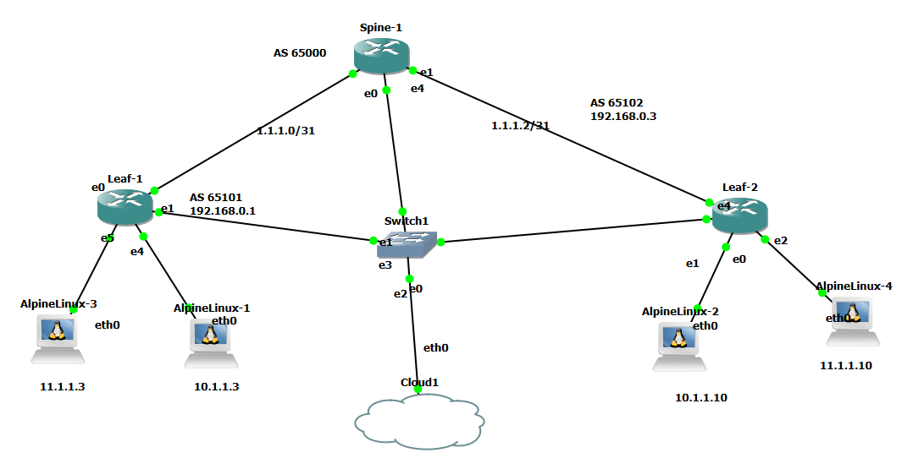

# Networking-automation-using-cluade-ai-MCP-server-and-Sonic
Networking automation using MCP server and Sonic. The topology is made of spine and leaf routers running sonic with vxlan evpn configuration. After bringing up the topology. Run broadband sonic on all the routers and configure the spine leaf with vxlan. Connect mcp server using claude ai, run show commands and push configurations to configure and manage the topology.

## 🚀 Overview

This project leverages Gns3 lab with three Broadcom sonic routers  Claude AI and the Model Context Protocol (MCP) to provide intelligent network automation capabilities. It combines the power of AI-driven decision making with industry-standard Ansible playbooks to manage Broadcom network devices efficiently.

### Key Features

- **AI-Powered Automation**: Use Claude AI to intelligently manage network configurations
- **MCP Server Integration**: Seamless integration with Claude through MCP for dynamic network operations
- **Ansible Integration**: Industry-standard playbooks for reliable network automation
- **Broadcom Gns3 Router Support**: Direct support for Broadcom Router devices
- ***BGP underlay configuration** : BGP is used as underlay configuration
- **Vxlan Evpn Configuration**: Automated OSPF routing protocol management
- **Alpine Linux as server endpoints**: Alpine servers in different vlans

  
## 📋 Prerequisites

- [x] Gns3 with Broadcom sonic image
- [x] Python 3.8 or higher
- [x] Access to Claude API with MCP Server capability
- [x] Broadcom sonic router images that will be deployed in Gns3
- [x] SSH access configured for your network devices
- [x] Alpine Linux images that will be deployed as endpoints on Gns3

## ⚒️ Project Tech Stack
The main tools and technologies used for building the project:
- [x] Claude AI (Claude Code)
- [x] MCP Server (FastMCP)
- [x] GNS3
- [x] Python
- [x] Netmiko (Sonic devices don't support Scrapli yet)
- [x] Broadcom 
- [x] Alpine Linux
- [x] VS Code

## Project Steps


- [x] Inventory
---
Newtwork json inventory file consists of  the spine and leaf routers and their types. 
Note: Netmiko reconizes two types of Sonic Dell sonic which works the same for Broadcom and Edgesonic that uses Community Sonic. If you choose Dell sonic connection goes straight to Dell or Broadcom CLI interface. If you choose Edgesonic, Netmiko connects to the sonic linux interface
```
---
{
	
  "Spine": { "host": "192.168.108.20", "device_type": "dell_sonic" },
  "Leaf1": { "host": "192.168.108.30", "device_type": "dell_sonic" },
  "Leaf2": { "host": "192.168.108.10", "device_type": "dell_sonic"}

}
```

- [x] The topology 

--- 
Consists of one Broadcom Spine connected to two Broadcom Leafs with two Alpine Linux connected to the each Leaf

---


- [x] Configuration
---
Spine/ Leaf vxlan evpn configuration with BGP underlay. Vlan 10 and 11 are L2 VNI with vlan 200 is L3 VNI. The configuration file can be found at sonic_vxlan.txtf file

---

- [x] Connect MCP server to your topology
---
- - connect your scripti to mcpserver using command 'claude mcp add mcpsonic_automation -s user -- "<mcpserverlocation>" "<name0fyourpythonscript>"'
- The mcp sever python script that connects Claude ai to your gns3 topology is found mcpserversonic.py file. 
- The script consists of importing FASTMCP and two async functions. "run_show" handles the "show commands" the ai uses to check status of network."Push_config" is async function that Claude uses to push configurations on the routers.
- The script uses Netmiko with ssh to connect to all there routers.
- By default broadcom sonic routers come with ssh enabled

----

- [x] Test McP Server with your topology
---
- Connect the mcp server and run the following command on Claude "can you check the vxlan tunnel between leaf1 and leaf2 and the vrf configured". Claude connects to your topology and pulls the following result. Claude used "run_show" to pull the figure by pushing show commands like "show vxlan tunnel"

---


- Next send command "add description "furtue use" to interface ethernet40 of leaf2". Claude uses "push_config" function to push configuration on interface Ethernet40 of Leaf2


      
